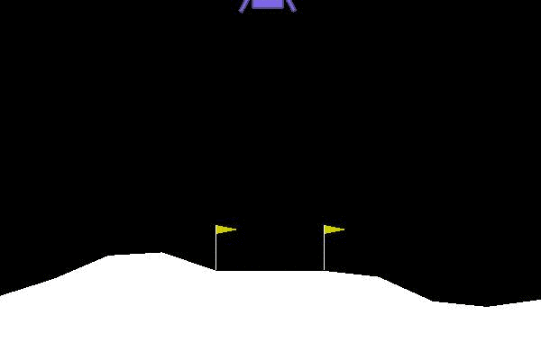
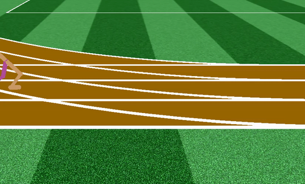
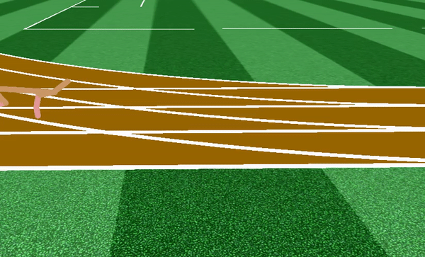

Codes adapted from [nikhilbarhate99/TD3-PyTorch-BipedalWalker-v2](https://github.com/nikhilbarhate99/TD3-PyTorch-BipedalWalker-v2)

# TD3-BipedalWalker-v2-PyTorch

PyTorch implementation of [Twin Delayed DDPG](https://arxiv.org/abs/1802.09477) (TD3)

## Results GIF

BipedalWalker-v2 (800 episodes)            |  LunarLanderContinuous-v2 (1500 episodes)
:-------------------------:|:-------------------------:
  |     |

RoboschoolWalker2d-v1 (lr=0.002, 1400 episodes)            |  HalfCheetah-v1 (lr=0.002, 1400 episodes)
:-------------------------:|:-------------------------:
  |     |

## References

- Official [TD3 paper](https://arxiv.org/abs/1802.09477) and [code](https://github.com/sfujim/TD3)
- [OpenAI SpinningUp in Deep RL](https://spinningup.openai.com/en/latest/algorithms/td3.html)

